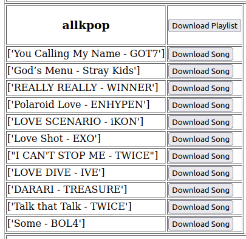

# Description:

This is a tool to download your spotify songs through youtube

# Get started

Make a file "secretkeys.py" in the root directory and complete the following using the next few steps:

>spotify_client_id=<your-spotify -client-id>

>spotify_client_secret=<your-spotify -client-secret>

>google_api_key = <your-google-api_key>

## Spotify API:

You have to register in spotify developers dashboard at https://developer.spotify.com/dashboard/login

After that, you need to create a new app. Find your client_id and client_secret   

In the new app , go to edit setting and add the following in redirect urls so spotify knows it is safe to redirect back to these:

- http://localhost:5000/redirect 

- http://localhost:5000/redirect/

## Google API:

follow this to make a project and get an api key https://developers.google.com/youtube/v3/getting-started

____
# Install the dependencies

Intall the following:

- youtube-dl

- flask

- spotipy

____
# How to use:

In the terminal run

> $flask run

Go to localhost:5000.

You will be prompted to login thorugh spotify. Login and review+accept the required permissions.

Your Songs will be displayed, download songs/ playlist by clicking on the corresponding button.

